# 🫀 SmartCPR Guardian
## AI-Driven Wearable Cardiac Arrest Detection, Emergency Dispatch & Automated CPR System


**Research Proposal for RA Position**
**University of Texas at Dallas — Department of Computer Science**
**Advisor (Target): Prof. Gopal Gupta | Co-Advisor: Prof. Lakshman Tamil**

---

## 📋 Table of Contents
1. [Executive Summary](#1-executive-summary)
2. [Problem Statement](#2-problem-statement)
3. [Proposed Solution](#3-proposed-solution)
4. [Full System Architecture](#4-full-system-architecture)
5. [Hardware Device Design](#5-hardware-device-design)
6. [AI & Software Stack](#6-ai--software-stack)
7. [Integration with Prof. Gupta's Lab](#7-integration-with-prof-guptas-lab)
8. [Integration with Prof. Tamil's Lab](#8-integration-with-prof-tamils-lab)
9. [Emergency Response Flow](#9-emergency-response-flow)
10. [Development Phases](#10-development-phases)
11. [Dataset Plan](#11-dataset-plan)
12. [Publication Roadmap](#12-publication-roadmap)
[🚀 Getting Started Guide](#-getting-started)


---

## 1. Executive Summary

Sudden cardiac arrest (SCA) kills **350,000+ Americans per year**. Survival rate drops **10% every minute** without CPR. Average ambulance response time is **8–12 minutes** — far too late for most victims.

**SmartCPR Guardian** is a wearable device that:
- 🔍 **Detects** cardiac arrest in real-time using an explainable AI model (FOLD-RM)
- 🚨 **Alerts** the nearest hospital and ambulance automatically with patient vitals and GPS
- 🤖 **Initiates CPR** mechanically within seconds of detection

This project directly extends Prof. Gupta's NSF-funded **Automated HF Diagnosis** project (Award #1916206) and Prof. Tamil's **wearable IoT cardiac monitoring** platform — bridging both labs into a single life-critical AI+hardware system.

---

## 2. Problem Statement

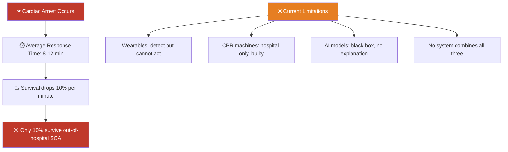

| Statistic | Value |
|---|---|
| Annual SCA deaths (USA) | **350,000+** |
| Survival without CPR in 10 min | **< 5%** |
| Survival WITH immediate CPR | **up to 45%** |
| Average ambulance response | **8–12 minutes** |
| Gap between arrest & CPR | **The critical window we close** |

---

## 3. Proposed Solution

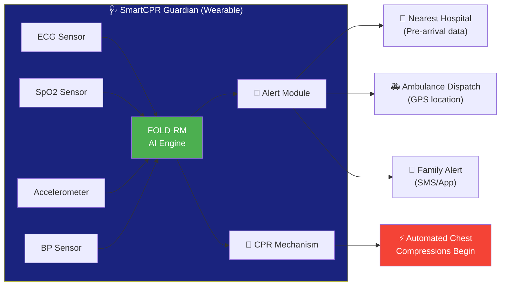

---

## 4. Full System Architecture

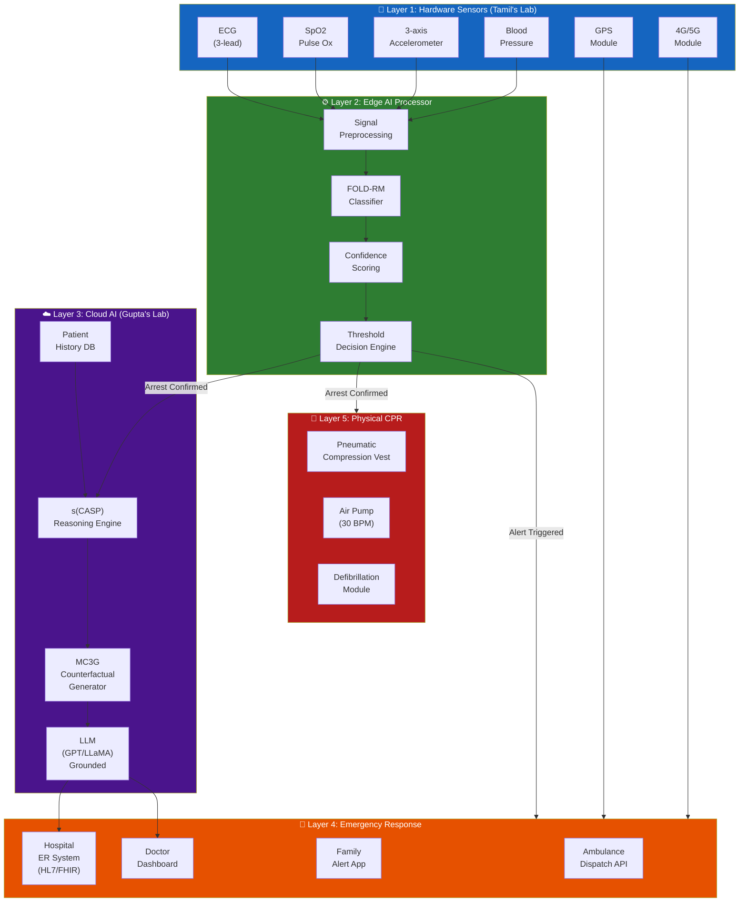

---

## 5. Hardware Device Design

### 5.1 Physical Design

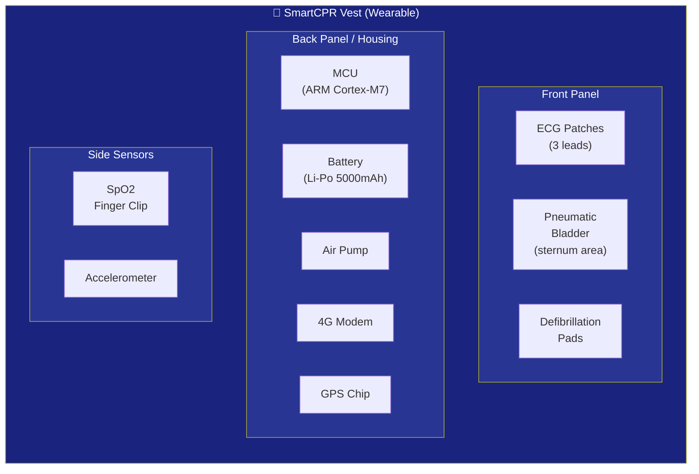

### 5.2 Hardware Components List

| Component | Spec | Purpose |
|---|---|---|
| **ECG Module** | ADS1292R (3-lead) | Heart rhythm detection |
| **SpO2 Sensor** | MAX30102 | Blood oxygen level |
| **Accelerometer** | MPU-6050 (6-DOF) | Motion/fall detection |
| **BP Sensor** | MEMS piezo | Blood pressure |
| **MCU** | STM32H7 (ARM Cortex-M7) | Edge AI processing |
| **4G Module** | SIM7600 | Emergency cellular alert |
| **GPS** | u-blox NEO-M8N | Location for dispatch |
| **Battery** | Li-Po 5000mAh | ~12hr operation |
| **Air Pump** | Micro DC pump 12V | CPR compression |
| **Pneumatic Bladder** | Silicone inflatable | Chest compressions |
| **Defibrillator** | 200J capacitor discharge | Shock for VFib |

### 5.3 CPR Mechanism Detail

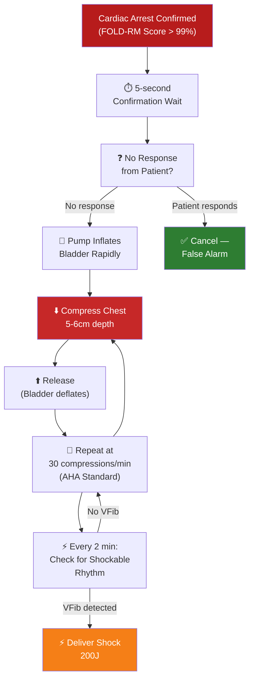

---

## 6. AI & Software Stack

### 6.1 On-Device AI (Edge) — FOLD-RM

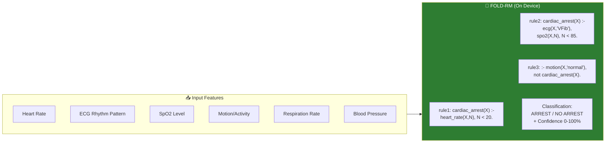

### 6.2 Cloud AI — s(CASP) + MC3G + LLM

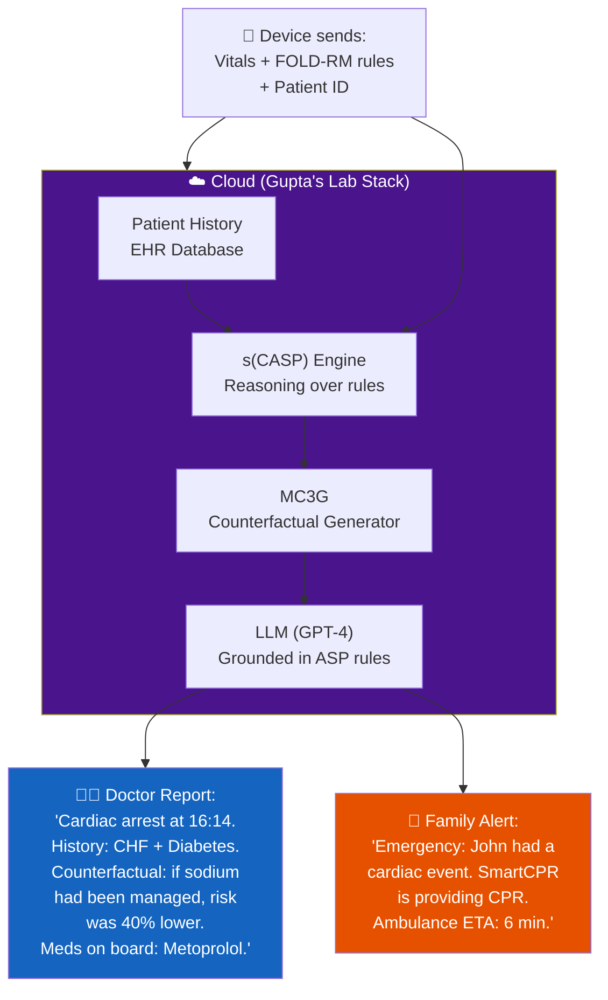

---

## 7. Integration with Prof. Gupta's Lab

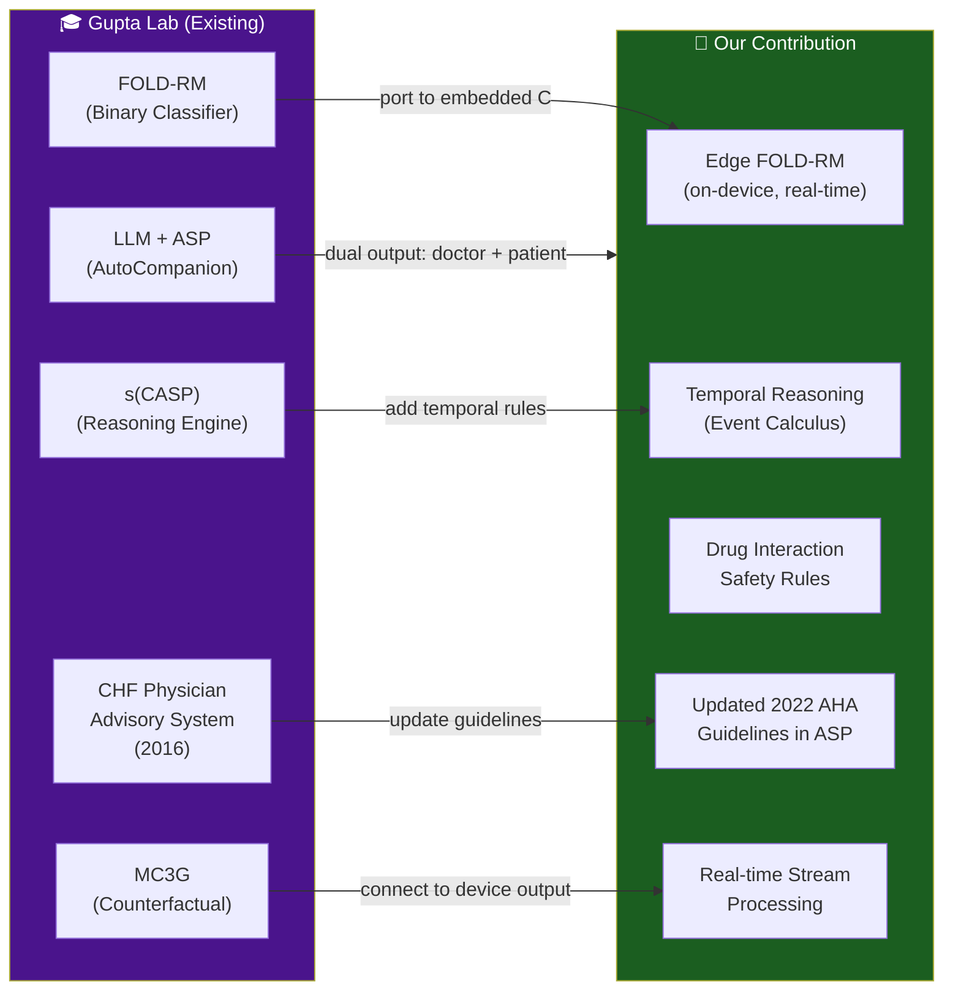

### What We Reuse vs. What We Build New

| Gupta's Existing Tool | We Reuse | We Extend |
|---|---|---|
| FOLD-RM (Python) | Core algorithm | Port to C for edge MCU |
| s(CASP) | Reasoning engine | Add temporal Event Calculus rules |
| MC3G | Counterfactual generation | Apply to cardiac arrest context |
| CHF Guidelines (ASP) | Existing rules | Update to 2022 AHA + add arrest rules |
| LLM + ASP pipeline | Grounding mechanism | Dual output (doctor + patient language) |

---

## 8. Integration with Prof. Tamil's Lab

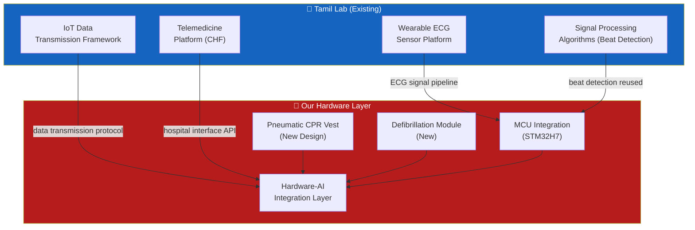

### Tamil Lab API Integration Points

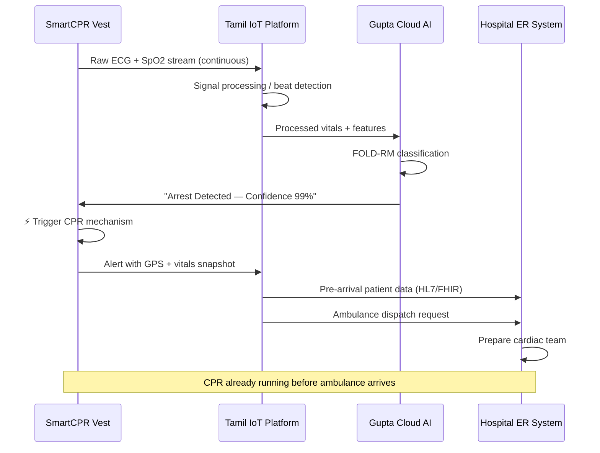

---

## 9. Emergency Response Flow

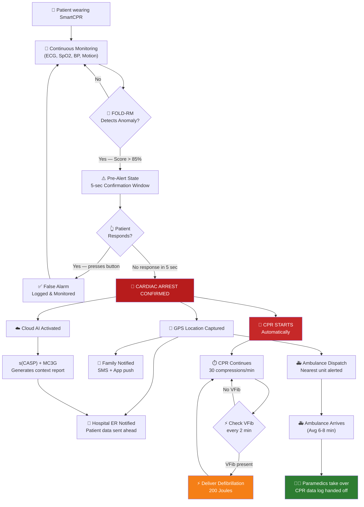

---

## 10. Development Phases

```mermaid
gantt
    title SmartCPR Guardian — 12-Month Development Plan
    dateFormat  MM
    axisFormat  Month %m

    section Phase 1: AI Detection
    Literature Review & Dataset Prep     :01, 1M
    Train FOLD-RM on ECG Arrest Data     :02, 2M
    Optimize for Edge Deployment         :03, 1M
    Validate (MIT-BIH + MIMIC-III)       :04, 1M

    section Phase 2: Alert System
    GPS + Cellular Module Integration    :04, 1M
    Hospital API (HL7/FHIR) Setup        :05, 1M
    Family Alert App (MVP)               :05, 1M
    End-to-End Alert Testing             :06, 1M

    section Phase 3: Cloud AI
    s(CASP) CHF Rules Update (2022 AHA)  :05, 1M
    MC3G Integration for Cardiac Arrest  :06, 2M
    LLM Dual-Output (Doctor + Patient)   :07, 1M
    Cloud-Device Pipeline Testing        :08, 1M

    section Phase 4: CPR Hardware
    Pneumatic Vest Prototype Design      :07, 2M
    Defibrillation Module                :08, 1M
    MCU Integration (STM32H7)            :09, 1M
    Safety Testing (False Positive Rate) :10, 1M

    section Phase 5: Integration & Paper
    Full System Integration Testing      :10, 1M
    IRB / Ethics Approval Process        :10, 2M
    Paper Writing (AAAI / IEEE EMBC)     :11, 2M
```

### Phase Details

| Phase | Months | Deliverables | Tools |
|---|---|---|---|
| **1: AI Detection** | 1–4 | Trained FOLD-RM on ECG, >99% sensitivity | Python, FOLD-RM lib, MIT-BIH dataset |
| **2: Alert System** | 4–6 | Working GPS dispatch + hospital API | SIM7600, HL7/FHIR, REST APIs |
| **3: Cloud AI** | 5–8 | Updated CHF rules + MC3G + LLM pipeline | s(CASP), Python, GPT-4 API |
| **4: CPR Hardware** | 7–10 | Working pneumatic vest prototype | STM32H7, Arduino, pneumatic components |
| **5: Integration** | 10–12 | Full system demo + paper submission | All of above |

---

## 11. Dataset Plan

| Dataset | Content | Use |
|---|---|---|
| **MIT-BIH Arrhythmia DB** | 48 ECG recordings, annotated | Train FOLD-RM for arrest detection |
| **MIMIC-III / MIMIC-IV** | ICU patient EHR, vitals, labs | CHF patient history + comorbidities |
| **PhysioNet 2015 Challenge** | Cardiac arrest ECG sequences | Test detection algorithm |
| **UCI Heart Disease** | 303 patient records | FOLD-RM classification benchmark |
| **AHA Cardiac Arrest Registry** | 150,000+ cases | Validation & epidemiology |

> All datasets are **publicly available and free** — no IRB needed for training phase.

---

## 12. Publication Roadmap

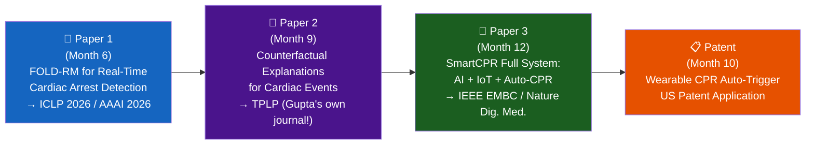
---

## 🚀 Getting Started

Follow these steps to run the **SmartCPR Guardian** prototype simulation on your local machine.

### Prerequisites
- Python 3.8+
- `pip`

### Installation
1. **Clone the repository**:
   ```bash
   git clone https://github.com/RachitJava/SmartCPR-Guardian.git
   cd SmartCPR-Guardian
   ```

2. **Install dependencies**:
   ```bash
   pip install -r requirements.txt
   ```

### Running the Prototype
1. **Start Detection Simulation**: `python ai_engine/fold_rm.py`
2. **Start Alert Dispatcher**: `python alert_system/dispatcher.py`

---

## 📎 Supporting Materials Checklist
- [ ] This proposal document (PDF export)
- [ ] CV (Python/ML + Embedded exp)
- [ ] Transcripts
- [ ] GitHub showing relevant projects

---

> **Key References to Read:**
> - FOLD-RM Paper: Wang, Shakerin, Gupta — TPLP 2022
> - MC3G Paper: Dasgupta et al. — arXiv 2025
> - AutoCompanion: Zeng et al. — TPLP Jan 2025
> - CHF Advisory System: Chen, Gupta — ICLP 2016
> - NSF Award #1916206 (HF Diagnosis project)
